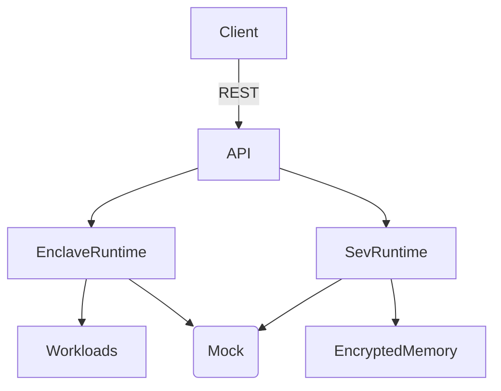
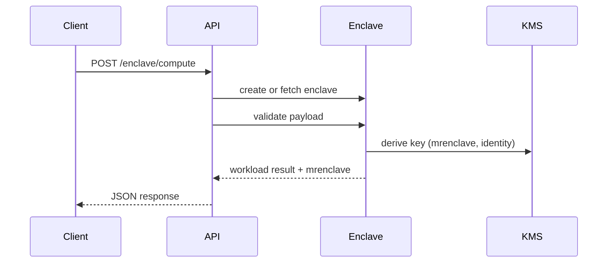
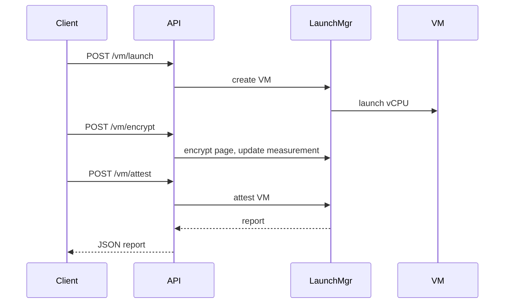

# Architecture Overview

This project models an educational confidential computing lab with simulated Intel SGX-like enclaves and AMD SEV-style encrypted VMs. The design emphasises clarity and auditability rather than hardware fidelity.

## High-Level Components
- **FastAPI Service**: REST gateway for enclave and VM operations with validation and logging.
- **Enclave Runtime**: Python simulation of enclave lifecycle, measurement, attestation, and sealed storage.
- **SEV Runtime**: Models VM creation, encrypted pages, vCPU launch, and VM attestation.
- **Mock KMS/HSM**: Deterministic key derivation and authenticated encryption for demo purposes.
- **Dashboard Assets**: Static HTML/JS/CSS for visual exploration (can be hosted via any static server).
- **Rust Stubs**: Mirrors enclave concepts for readers who prefer Rust examples.

## Data Flow

## Enclave Lifecycle (SGX-style simulation)
1. **Load**: Pages are provisioned, and an SHA-256 measurement (MRENCLAVE) is derived.
2. **Enter/ECALL**: Trusted entry points validate names before execution.
3. **OCALL**: Untrusted interactions are modelled with structured payload echoes.
4. **Sealed Storage**: Identity + measurement derived key wraps JSON payloads using the mock KMS.
5. **Attestation**: Generates nonce + measurement reports for verification exercises.

Sequence:

## SEV Lifecycle (VM simulation)
1. **Launch**: VM is created with encrypted memory container; a vCPU is initialised.
2. **Encrypt Page**: Per-page keys (VM identity + page id) encrypt data with integrity.
3. **Measure**: Hash over VM metadata and encrypted pages yields a reproducible measurement.
4. **Attest**: Produces nonce + measurement report for remote verification practice.

Sequence:

## Security Posture
- All crypto is educational, uses standard library primitives, and is intentionally transparent.
- Input validation, logging, and defensive error handling protect against misuse.
- No real hardware isolation or side-channel modelling is included; this is a safe lab.

## Extension Points
- Swap the mock KMS with a real HSM/KMS SDK for deeper demos.
- Add workload modules under `server/workloads` for new privacy-preserving patterns.
- Integrate a frontend build chain for the dashboard if richer visuals are needed.
